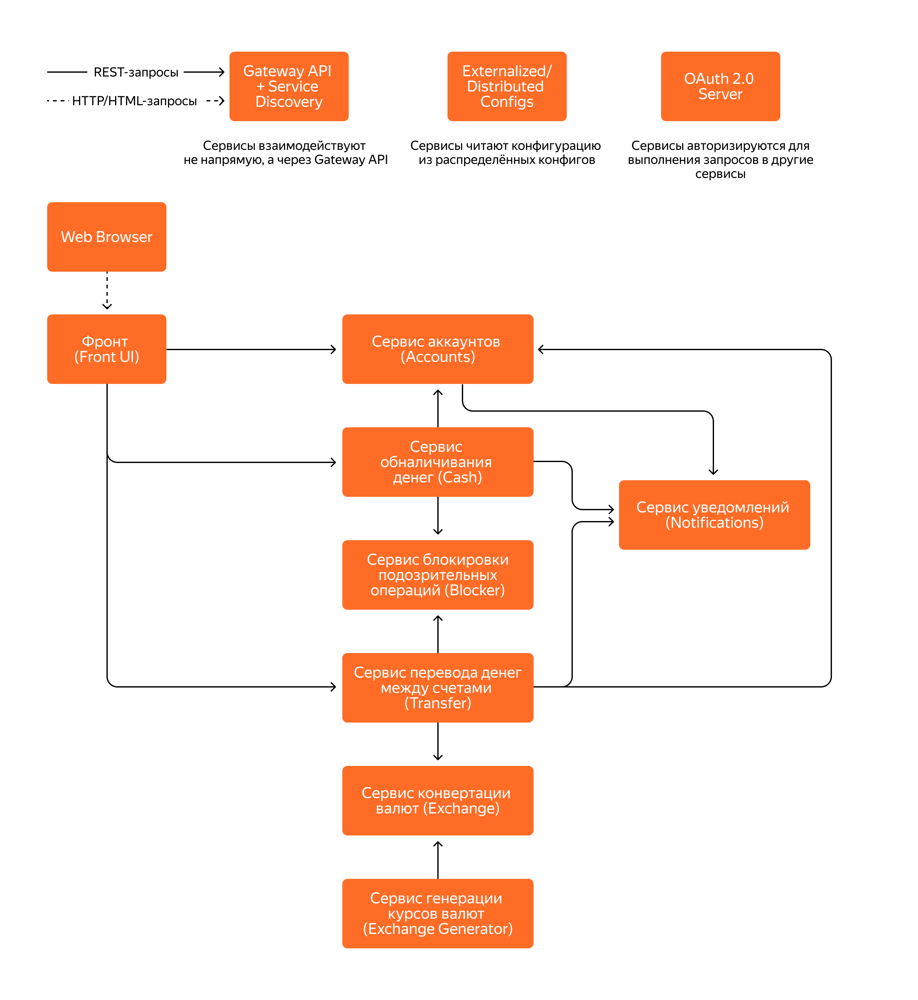

# Инструкция

## Запуск сервисов и инфрастуктуры в докере 
1. Соберите проект (**mvn clean package -DskipTests=true**). Есть возможность также прогнать тесты, при этом не должно быть поднятых
контейнеров. Также нужно удостовериться, что для контрактных тестов сначала генерируются стабы, а потом вызываются зависимые тесты.
2. Поднимите keycloak, postgresql **docker compose up keycloak db**, дождитесь успешного запуска.
3. Поднимите микросервисы **docker-compose up --build**.
4. Пользуйтесь приложением. Главная страница - http://localhost:8086/home

## Запуск сервисов в IDE, инфраструктуры в докере 
1. Перейдите в директорию local-setup **cd local-setup**.
2. Поднимите keycloak, postgresql **docker compose up keycloak db**, дождитесь успешного запуска.
3. Запустите микросервисы в любой удобной IDE.
4. Пользуйтесь приложением. Главная страница - http://localhost:8086/home

## Запуск флота в локальном k8s кластере вручную (развёртывание микросервисов в Kubernetes с использованием Helm-чартов)
1. Поднимите виртуальную машину с k8s. Например, colima: ```colima start --cpu 4 --memory 6 --kubernetes --network-address --profile bank_app```
2. В корневой папке проекта соберите проект: ```mvn clean package -DskipTests=true```
3. Соберите образы для сервисов:
```
docker build -t accounts-service:0.0.1-SNAPSHOT ./accounts-service && \
docker build -t blocker-service:0.0.1-SNAPSHOT ./blocker-service && \
docker build -t cash-service:0.0.1-SNAPSHOT ./cash-service && \
docker build -t exchange-generator-service:0.0.1-SNAPSHOT ./exchange-generator-service && \
docker build -t exchange-service:0.0.1-SNAPSHOT ./exchange-service && \
docker build -t front-ui:0.0.1-SNAPSHOT ./front-ui && \
docker build -t notification-service:0.0.1-SNAPSHOT ./notification-service && \
docker build -t transfer-service:0.0.1-SNAPSHOT ./transfer-service
```
Важно: проверьте, что контекст докера указывает на вашу виртуальную машину: ```docker context ls```
должен помечать звездочкой контекст связанный с VM, например, colima.
4. Создайте ингресс контроллер: ```kubectl apply -f https://raw.githubusercontent.com/kubernetes/ingress-nginx/controller-v1.10.1/deploy/static/provider/cloud/deploy.yaml```
5. Перейдите в папку с helm чартами и обновите зависимости: ```cd bank-app-helm-chart```, ```helm dependency update .```
6. Создайте неймспейс: ```kubectl create namespace bank-app-develop```
7. Создайте секрет для базы данных: 
```
kubectl create secret generic bank-app-common-db-postgresql \
     --from-literal=password=postgres \
     --from-literal=postgresql-password=postgres \
     --from-literal=postgres-password=postgres \
     -n bank-app-develop
```
8. Установите helm релиз: ```helm upgrade --install bank-app ./ --namespace bank-app-develop```
9. Запустите тесты на helm чарты: ```helm test bank-app -n bank-app-develop```
10. Узнайте INTERNAL-IP через ```kubectl get nodes -o wide``` и запишите маппинг адресов ```sudo nano /etc/hosts``` в 
таком виде: ```ЗНАЧЕНИЕ_INTERNAL_IP http://front-ui.myapp.local```
11. Когда релиз будет завершен и поды поднимутся, можно проверить healthcheck-эндпойнт ```http://front-ui.myapp.local/actuator/health```
и пользоваться приложением. Главная страница - http://front-ui.myapp.local/home

## Запуск флота в локальном k8s кластере из Jenkins (непрерывная интеграция и доставка микросервисов с помощью Jenkins) 
1. Склонируйте проект. Запушьте проект в свой Github репозиторий.
2. Поднимите виртуальную машину с k8s. Например, colima: ```colima start --cpu 6 --memory 10 --kubernetes --network-address --profile bank_app```
3. Создайте ингресс контроллер: ```kubectl apply -f https://raw.githubusercontent.com/kubernetes/ingress-nginx/controller-v1.10.1/deploy/static/provider/cloud/deploy.yaml```
4. Скопируйте содержимое своего файла конфигурации k8s **~/.kube/config** в файл проекта **jenkins_kubeconfig.yaml**.
5. Актуализируйте jenkins/.env файл проекта согласно своим данным.
6. Из папки jenkins запустите контейнер с Jenkins: ```docker compose up --build```
7. Перейдите на главную страницу Jenkins: localhost:8080. Посмотрите информацию о пайплайне, сборках.
Сборка будет запущена автоматически, но можно запустить по желанию. Для удобства просматривайте прогресс в Blue Ocean.
8. Подтвердите, хотите ли деплоить на прод. Если нет, то микросервисы и инфрастуктура будут созданы только в неймспейсе test,
иначе также и в prod.
9. Аналогично шагу 10 из предыдущего пункта добавьте маппинг на http://front-ui.test.local и/или http://front-ui.prod.local.
10. По желанию проверьте health эндпойнты. Пользуйтесь приложением - http://front-ui.test.local/home или http://front-ui.prod.local/home

# Задание❗️
Написать микросервисное приложение «Банк» с использованием Spring Boot и паттернов микросервисной архитектуры.✅
Реализовать развёртывание микросервисов в Kubernetes с использованием Helm-чартов.
Настроить непрерывную интеграцию и доставку микросервисов с помощью Jenkins.

# Требования к приложению
1) Микросервисы приложения написаны на Spring Boot.
2) Код приложения хранится в Git-репозитории на GitHub.
3) Микросервисы приложения собираются с помощью Maven.
4) Есть возможность собирать сразу все микросервисы одной командой (с помощью parent POM и использования мультимодульных проектов).
5) Код приложения написан на Java 21.
6) Web UI приложения использует Spring Web MVC.
7) Приложение использует Spring Data JPA и Hibernate ORM под капотом для доступа к данным в базе данных.
8) База данных для микросервисов приложения персистентная (PostgreSQL); одна, но микросервисы разграничены на уровне схем, чтобы реализовать паттерн Database per Service.
9) В качестве Service Discovery применяется Consul, Gateway API - самописный сервис, реализующий паттерны Service Discovery и Gateway API, с использованием проекта Spring Cloud Gateway.
10) Микросервисы выполняют запросы в другие микросервисы через Gateway API и регистрируются в Service Discovery.
11) В качестве Externalized/Distributed Config применяется Consul.
12) Микросервисы получают общие настройки из Externalized/Distributed Config.
13) В качестве сервера авторизации OAuth 2.0 используется Keycloak.
14) В микросервисах авторизация осуществляется на сервере OAuth 2.0, чтобы можно было получать Access Token (JWT) по client credentials для выполнения запросов в другие микросервисы.
15) Микросервисы умеют выполнять ретраи запросов, а также иметь фоллбэки на эндпоинты заглушки (Resilence4j).
16) Микросервисы приложения можно собрать из исходников и запустить локально.
17) Микросервисы приложения упакованы в Executable JAR и запускаются в Tomcat.
18) Приложение покрыто тестами (юнит, интеграционными, контрактными) с использованием JUnit 5, TestContext Framework, Spring Boot Test, кеширования контекстов и Spring Cloud Contract.
19) Микросервисы написаны и протестированы с использованием паттернов микросервисной архитектуры приложения.
20) Executable JAR микросервисов упакованы в Docker-контейнеры с открытым веб-портом для доступа из браузера или межсервисного взаимодействия, чтобы реализовать паттерн Single Service per Host.
21) Запускать микросервисы можно все вместе с помощью Docker Compose или по одному вручную с помощью команд Docker.

# Функциональность
1. Микросервисное приложение «Банк» — это приложение с веб-интерфейсом, которое позволяет пользователю (клиенту банка):
- регистрироваться в системе по логину и паролю (заводить аккаунт);
- добавлять счета в различных валютах;
- класть виртуальные деньги на счёт и снимать их;
- переводить деньги между своими счетами с учётом конвертации в различные валюты;
- переводить деньги на другой счёт с учётом конвертации в различные валюты.
2. Приложение состоит из следующих микросервисов:
- [фронта (Front UI)](#фронт-front-ui);
- [сервиса аккаунтов (Accounts)](#сервис-аккаунтов-accounts);
- [сервиса обналичивания денег (Cash)](#сервис-обналичивания-денег-cash);
- [сервиса перевода денег между счетами одного или двух аккаунтов (Transfer)](#сервис-перевода-денег-между-счетами-transfer);
- [сервиса конвертации валют (Exchange)](#сервис-конвертации-валют-exchange);
- [сервиса генерации курсов валют (Exchange Generator)](#сервис-генерации-курсов-валют-exchange-generator);
- [сервиса блокировки подозрительных операций (Blocker)](#сервис-блокировки-подозрительных-операций-blocker);
- [сервиса уведомлений (Notifications)](#сервис-уведомлений-notifications).

## Фронт (Front UI)
Фронт (Front UI) — это веб-приложение с клиентским HTML-интерфейсом. Предоставляет следующие HTML-страницы:
1. Cтраницу ввода логина/пароля.
Можно предусмотреть аутентификацию remember-me. Можно использовать дефолтную страницу, которую предоставляет Spring Security.
Страница содержит:
- поле ввода логина;
- поле ввода пароля;
- кнопку «Войти», при нажатии на которую происходит аутентификация/авторизация пользователя и редирект на главную страницу.
2. Страницу выхода из приложения (разлогинивания).
Можно использовать дефолтную страницу, которую предоставляет Spring Security.
Страница содержит ссылку, при нажатии на которую:
- пользователь разлогинивается;
- происходит редирект на страницу ввода логина/пароля.
3. Страницу регистрации пользователя в приложении (нового аккаунта).
Страница содержит:
- поля ввода фамилии, имени, почты (если планируется отправлять уведомления на почту), даты рождения;
- поля ввода логина и пароля;
- кнопку «Зарегистрироваться», при нажатии на которую происходит проверка введённых данных и создаётся новый аккаунт с автоматической аутентификацией/авторизацией пользователя и редиректом на главную страницу (должна быть предусмотрена валидация: все поля заполнены, возраст старше 18 лет).
4. Главную страницу, которая доступна только после успешной аутентификации/авторизации пользователя.
Страница содержит:
- [блок настроек аккаунта](#блок-настроек-аккаунта);
- [блок внесения и снятия виртуальных денег](#блок-внесения-и-снятия-виртуальных-денег);
- [блок перевода денег между своими счетами](#блок-перевода-денег-между-своими-счетами);
- [блок перевода денег на счёт другого аккаунта](#блок-перевода-денег-на-счёт-другого-аккаунта);
- [блок курсов валют](#блок-курсов-валют).
### Блок настроек аккаунта
Состоит из:
- логина пользователя без возможности редактирования, но с возможностью удаления (если есть хотя бы один ненулевой счёт, то должна появляться ошибка);
- поля ввода нового пароля и кнопки «Изменить пароль», при нажатии на которую меняется пароль пользователя (пароль должен быть непустой);
- фамилии, имени, почты (если предполагается отправлять уведомления на почту) и даты рождения с возможностью их редактирования (должна быть предусмотрена валидация: все поля заполнены, возраст старше 18 лет);
- списка счетов пользователя с возможностью их добавления, редактирования и удаления (у пользователя может быть не более одного счёта в определённой валюте);
- ссылки на страницу разлогинивания.
### Блок внесения и снятия виртуальных денег
Состоит из:
- поля выбора счёта (обязательно);
- поля ввода суммы снятия (обязательно);
- кнопок «Положить» и «Снять» (если сумма, которую нужно снять, больше суммы на счёте, то должна появляться ошибка).
### Блок перевода денег между своими счетами
Состоит из:
- поля выбора своего счёта для отправки денег (обязательно);
- поля выбора своего счёта для получения (обязательно);
- поля ввода суммы перевода (если сумма больше суммы на счёте отправления, то должна появляться ошибка);
- кнопки, при нажатии на которую осуществляется перевод денег.
### Блок перевода денег на счёт другого аккаунта
Состоит из:
- поля выбора своего счёта для отправки денег (обязательно);
- поля выбора счёта получателя (обязательно, с поиском по аккаунту);
- поля ввода суммы перевода (если сумма больше суммы на счёте отправления, то должна появляться ошибка);
- кнопки, при нажатии на которую осуществляется перевод денег.
### Блок курсов валют
1. Первый столбец таблицы — валюта.
2. Второй столбец — покупка.
3. Третий столбец — продажа.

## Сервис аккаунтов (Accounts)
Сервис аккаунтов хранит информацию о зарегистрированных аккаунтах и счетах в каждом из них (именно в нём хранятся логин/пароль, которые проверяются при аутентификации пользователя).
- Фронт выполняет REST-запросы (в формате JSON) из блока настроек аккаунта в сервис Accounts при получении данных аккаунта и данных о счетах, их редактировании, добавлении и удалении.
- В свою очередь, Accounts выполняет REST-запросы (в формате JSON) в Notifications.
- Также в Accounts приходят запросы при регистрации нового аккаунта (из формы регистрации).

## Сервис обналичивания денег (Cash)
Сервис обналичивания денег осуществляет пополнение счёта или снятие денег со счёта.
- Фронт выполняет REST-запросы (в формате JSON) из блока внесения и снятия виртуальных денег в сервис Cash.
- В свою очередь, Cash выполняет REST-запросы (в формате JSON) в Accounts, Blocker и Notifications.

## Сервис перевода денег между счетами (Transfer)
Сервис перевода денег между счетами осуществляет перевод денег между счетами одного пользователя и между счетами разных пользователей.
- Фронт выполняет REST-запросы (в формате JSON) из блока перевода денег между своими счетами и блока перевода денег на счёт другого аккаунта в сервис Transfer.
- В свою очередь, Transfer выполняет REST-запросы (в формате JSON) в Accounts, Exchange, Blocker и Notifications.

## Сервис конвертации валют (Exchange)
Сервис конвертации валют хранит информацию о конвертации валюты при её покупке/продаже (базовой валютой считается RUB, её конвертация при продаже/покупке равна 1).
Фронт выполняет REST-запросы (в формате JSON) из блока курсов валют в сервис Exchange для получения информации о курсах валют.

## Сервис генерации курсов валют (Exchange Generator)
Сервис генерации курсов валют каждую секунду по расписанию генерирует курсы валют (алгоритм на ваш выбор: Round Robin из файла, БД, случайные значения и т. д.) и выполняет REST-запросы (в формате JSON) в сервис Exchange.
Валют должно быть не меньше трёх: RUB, USD, CNY. Базовой валютой считается RUB, то есть при конвертации, например, из USD в CNY сначала USD конвертируется в RUB, а потом RUB в CNY.
Спред между курсами покупки и продажи не реализовывался для упрощения. 

## Сервис блокировки подозрительных операций (Blocker)
Сервис блокировки подозрительных операций отслеживает подозрительные операции (алгоритм на ваш выбор: случайно, в зависимости от текущего времени и т. д.).

## Сервис уведомлений (Notifications)
Сервис уведомлений отправляет уведомления (для упрощения пишет уведомления в консоль) пользователю о выполненном действии: переводе денег, пополнении счёта, снятии денег со счёта и т. д.

Итоговая схема взаимодействия сервисов выглядит так:


3. Микросервисы должны аутентифицироваться/авторизовываться на сервере авторизации по client credentials, чтобы выполнять запросы в другие микросервисы.
У одного микросервиса может не быть доступа к выполнению запросов в другой микросервис (например, микросервис Exchange не может выполнять запросы в Accounts).
4. Аутентификация/авторизация пользователей должны быть по логину/паролю. У пользователя есть доступ к информации только о своём аккаунте и счетах.